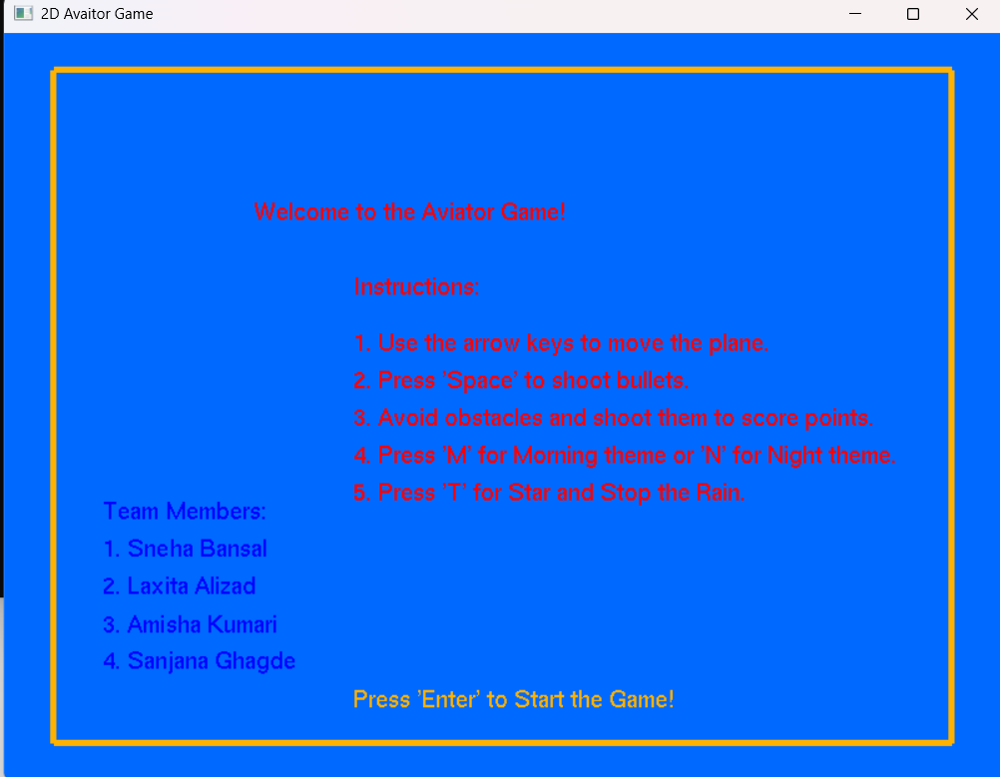
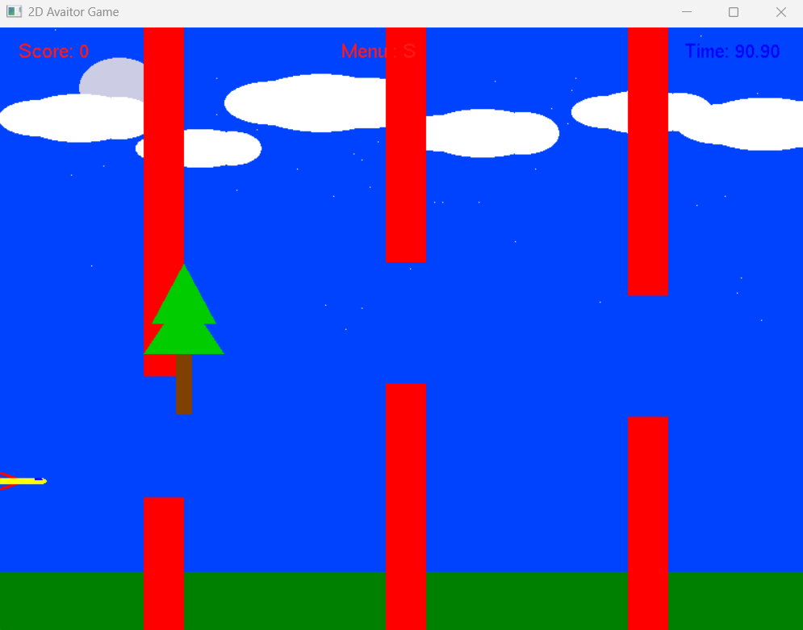
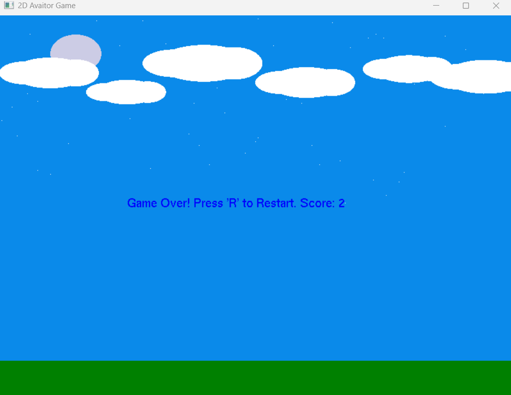
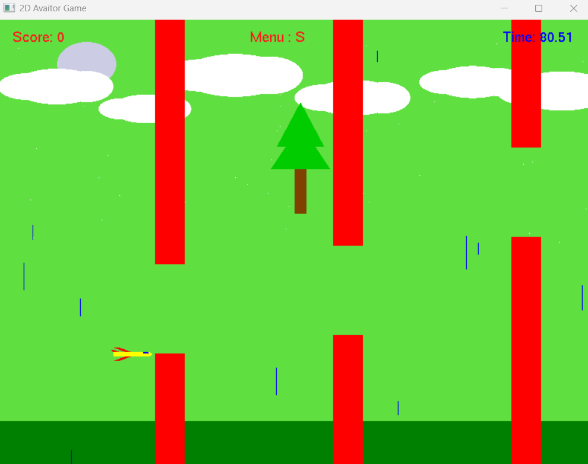

# ✈️ Aviator Game (2D Plane Game Simulation)

A 2D Plane Simulation Game built using **C++** and **OpenGL (GLUT)**.  
Fly your plane, dodge obstacles, shoot bullets, and experience day-night transitions and dynamic weather effects — all in real-time!

## 🚀 Features
- **Plane Control**: Move your plane (up, down, left, right) with keyboard inputs.
- **Day-Night Cycle**: Smooth transition from day 🌞 to night 🌚 during gameplay.
- **Dynamic Weather**: 
  - Realistic clouds ☁️
  - Rain effect ☔
- **Obstacles**: Falling trees 🌳 that you must dodge.
- **Collision Detection**: Game ends if your plane collides with obstacles.
- **Bullets & Shooting**: Shoot bullets to clear obstacles.
- **Score Tracking**: Earn points for dodging and shooting.
- **Animated Environment**: Moving trees, clouds, and weather.
- **Sound Effects**: Engaging audio for shooting and collisions.

## 🖥️ Technologies Used
- **C++**
- **OpenGL (GLUT)**
- **GL Utility Toolkit** for window and input management
- **Basic sound libraries** (optional)

## 🎮 Controls
| Key        | Action              |
|------------|---------------------|
| `W` / `Up Arrow`    | Move Up            |
| `S` / `Down Arrow`  | Move Down          |
| `A` / `Left Arrow`  | Move Left          |
| `D` / `Right Arrow` | Move Right         |
| `Spacebar`          | Shoot Bullet       |
| `Esc`               | Exit Game          |

## 🛠️ How to Run
1. Make sure you have **OpenGL** and **GLUT** installed.
2. Compile the code:
    ```bash
    g++ aviator_game.cpp -o aviator_game -lGL -lGLU -lglut
    ```
3. Run the game:
    ```bash
    ./aviator_game
    ```

## 📸 Screenshots


### 🚀 Plane Flying (Day Mode)


### 🌚 Night Mode


### ☔ Rain Effect


### 🌳 Obstacles and Shooting



## 📚 Learnings
- Real-time game loop creation in C++
- Handling animations using OpenGL
- Implementing physics-based collision detection
- Working with sound in C++ games
- Managing game states (start, running, game over)

## 📄 License
This project is for educational purposes and personal portfolio. Feel free to explore and learn!

---

